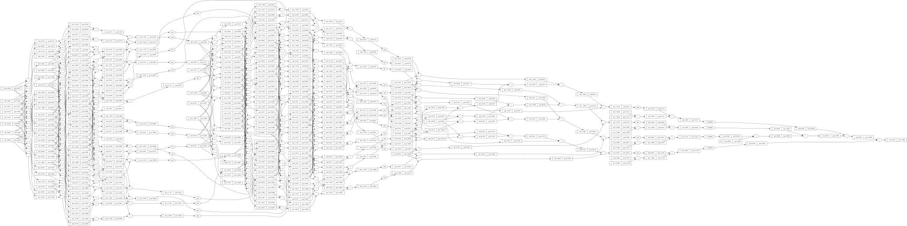

# scalergrad

A tiny Autograd engine in C++. Implements backpropagation (reverse-mode autodiff) over a dynamically built DAG of scalar `Value` objects, and a small neural networks library on top of it with a PyTorch/micrograd-like API. The DAG only operates over scalar values, so a neuron is broken down into all of its individual tiny adds and multiplies — but that's still enough to build and train real feed-forward neural nets. Built for learning how autograd actually works, under the hood, in C++.

### Installation

`scalergrad` is a header-only C++ library, published as a [vcpkg](https://vcpkg.io) port.

```bash
vcpkg install scalergrad
```

Then, in your `CMakeLists.txt`:

```cmake
find_package(scalergrad CONFIG REQUIRED)
target_link_libraries(your_target PRIVATE scalergrad::scalergrad)
```

And configure your project with the vcpkg toolchain file:

```bash
cmake -B build -DCMAKE_TOOLCHAIN_FILE=/path/to/vcpkg/scripts/buildsystems/vcpkg.cmake
```

> **Note:** `scalergrad`'s vcpkg port has been submitted to the official [microsoft/vcpkg](https://github.com/microsoft/vcpkg) registry and is currently awaiting maintainer review. Until the PR is merged, `vcpkg install scalergrad` will fail with a "package not found" error, since it isn't in the registry yet. In the meantime, you can install it using vcpkg's **overlay ports** feature, which points vcpkg at a local port directory instead of the official registry:
>
> ```bash
> git clone https://github.com/<your-github-username>/scalergrad.git
> vcpkg install scalergrad --overlay-ports=./scalergrad/ports
> ```
>
> Once the PR is merged, this overlay step won't be necessary anymore — `vcpkg install scalergrad` will work directly, and this note will be removed.

### Example usage

Below is a small example showing the core engine API directly — every operation is tracked on the computation graph, and calling `backward` propagates gradients back through it:

```cpp
#include <scalergrad/engine.hpp>
#include <iostream>

int main()
{
    auto a = make_value(-4.0, "a");
    auto b = make_value(2.0, "b");
    auto c = a + b;
    auto d = a * b + pow(b, 3);
    c = c + c + 1.0;
    c = c + 1.0 + c + (-a);
    d = d + d * 2.0 + tanh(b + a);
    d = d + 3.0 * d + tanh(b - a);
    auto e = c - d;
    auto f = pow(e, 2);
    auto g = f / 2.0;
    g = g + 10.0 / f;

    std::cout << g->data << std::endl; // forward pass result
    backward(g);
    std::cout << a->grad << std::endl; // dg/da
    std::cout << b->grad << std::endl; // dg/db
}
```

Every `Value` in `scalergrad` is a `ValuePtr` (a `std::shared_ptr<Value>`) under the hood, which is what lets the same node be safely reused across many operations in the graph — the pattern you'll see throughout the engine and neural net API.

### Training a neural net

`scalergrad/neural_net.hpp` builds `Neuron`, `Layer`, and `MLP` classes directly on top of the engine — so you can define, train, and run a small feed-forward network without touching a single `Value` yourself.

Here's a full example: training a 2-hidden-layer MLP to fit four data points.

```cpp
#include <iostream>
#include <scalergrad/neural_net.hpp>
#include <scalergrad/visualization.hpp>

using namespace std;
int main()
{
    MLP n(3, {4, 4, 1});

    //? input data
    vector<vector<double>> xi = {
        {2.0, 3.0, -1.0},
        {3.0, -1.0, 0.5},
        {0.5, 1.0, -1.0},
        {1.0, 1.0, -1.0},
    };

    //? target data
    vector<double> target = {1.0, -1.0, -1.0, 1.0};

    vector<ValuePtr> prediction;
    ValuePtr final_loss;

    for (int k = 0; k < 1000; k++)
    {
        //? Forward pass
        prediction.clear();
        for (const auto &x : xi)
            prediction.push_back(n(x));

        //? loss calculation
        ValuePtr loss = make_value(0.0, "loss");
        for (size_t i = 0; i < target.size(); i++)
        {
            ValuePtr difference = prediction[i] - target[i];
            loss = loss + pow(difference, 2);
        }

        //? zero grad
        for (auto &p : n.parameters())
            p->grad = 0.0;

        //? Backward pass
        backward(loss);

        //? Gradient descent
        for (auto &p : n.parameters())
        {
            p->data += -0.01 * p->grad;
        }

        if (k == 999)
        {
            final_loss = loss;
            final_loss->label = loss->label;
        }
    }
    cout << "Loss : " << final_loss->data << endl;
    cout << "Prediction data : " << "{ ";
    for (const auto &pred : prediction)
    {
        cout << pred->data << " ";
    }
    cout << " }" << endl;

    draw_dot(final_loss);

    return 0;
}
```

Let's walk through what's actually happening here, step by step:

1. **`MLP n(3, {4, 4, 1})`** creates a multi-layer perceptron that takes 3 inputs, has two hidden layers of 4 neurons each, and a single output neuron. Internally, this builds a stack of `Layer`s, and each `Layer` is a stack of `Neuron`s, and every weight and bias in every neuron is a randomly-initialized `Value` sitting on the autograd graph.

2. **`xi` and `target`** are the training data: four input vectors, each with 3 features, and the number each one is supposed to map to.

3. Inside the training loop, the **forward pass** runs every input through the network: `n(x)` returns a single `ValuePtr` — the network's prediction for that input.

4. The **loss** is the sum of squared differences between each prediction and its target — a standard mean-squared-error-style loss, built entirely out of `Value` arithmetic (`-`, `pow`, `+`), so it's automatically part of the same computation graph as every weight in the network.

5. Before every backward pass, gradients are **zeroed out** (`p->grad = 0.0`). This matters because `scalergrad`, like PyTorch, *accumulates* gradients rather than overwriting them — so without this reset, gradients from previous steps would keep adding up.

6. **`backward(loss)`** walks the entire computation graph backward from the loss, computing `∂loss/∂p` for every single parameter `p` in the network — every weight and bias — via the chain rule.

7. **Gradient descent** nudges every parameter a small step in the direction that reduces the loss: `p->data += -0.01 * p->grad`. `0.01` here is the learning rate.

8. Repeating this 1000 times is what actually trains the network — each iteration, the loss should get a little lower, and the predictions should get a little closer to the targets.

Running this, you'll see the loss drop steadily over the 1000 epochs, and the final predictions land close to `{1.0, -1.0, -1.0, 1.0}` — meaning the network has learned to (roughly) reproduce your data.

As per this tutorial, you've built a small neural net that learns to predict the target values for a handful of hand-crafted inputs, entirely from a scalar autograd engine you now understand end-to-end. If you want to *see* what the network's final computation graph actually looks like, `scalergrad` can render it for you as an SVG — literally by adding one line:

```cpp
draw_dot(final_loss);
```

This traces the whole DAG backward from `final_loss`, writes out a `.dot` file, and (if you have [Graphviz](https://graphviz.org/) installed) renders it straight to SVG. Every node shows its `data` and `grad` values, so you can visually follow exactly how a single number — the loss — ends up depending on every weight in the network:



To see the complete, ready-to-run version of this example, check out [`example/main.cpp`](example/main.cpp).

### API Reference

`scalergrad` is split across three headers. `engine.hpp` is the autograd core, `neural_net.hpp` builds neural network layers on top of it, and `visualization.hpp` renders a `Value`'s computation graph. `neural_net.hpp` and `visualization.hpp` both include `engine.hpp` for you, so in most projects you'll only ever write `#include <scalergrad/neural_net.hpp>` (and `visualization.hpp` if you want graphs).

#### `scalergrad/engine.hpp`

##### `struct Value`

The core unit of the autograd graph. Every number that takes part in a computation — inputs, weights, biases, intermediate results — is a `Value`.

| Member | Type | Description |
|---|---|---|
| `data` | `double` | The value's actual number. |
| `grad` | `double` | The gradient of the final output with respect to this value, accumulated by `backward`. Starts at `0.0`. |
| `label` | `std::string` | An optional human-readable name, mainly used by `draw_dot` when rendering graphs. |
| `_prev` | `std::vector<ValuePtr>` | The values this one was computed from. Used internally to walk the graph. |
| `_operation` | `std::string` | The operation that produced this value (e.g. `"+"`, `"tanh"`). Used internally and by `draw_dot`. |

You won't usually construct a `Value` directly — use `make_value` instead.

##### `using ValuePtr = std::shared_ptr<Value>`

Every function in `scalergrad` passes `Value`s around as `ValuePtr`. This is what lets the same node be safely shared as a child of multiple other nodes in the graph (e.g. a weight reused across every training example).

##### `ValuePtr make_value(double d, std::string label = "")`

Creates a new leaf `Value` — one with no parents in the graph. This is how you create inputs, weights, or any starting number.

```cpp
auto x = make_value(2.0, "x");
```

##### Operators: `+`, `-`, `*`, `/`, unary `-`

Standard arithmetic, overloaded for `ValuePtr op ValuePtr`, `ValuePtr op double`, and `double op ValuePtr`. Each one builds a new `Value` on the graph with the correct `_backward` closure already attached, so gradients flow correctly through it once you call `backward`.

```cpp
auto a = make_value(2.0);
auto b = make_value(3.0);
auto c = a + b;       // Value + Value
auto d = a * 2.0;      // Value * double
auto e = 5.0 - a;      // double - Value
auto f = -a;           // unary negation
```

##### `ValuePtr pow(const ValuePtr &a, double n)`

Raises `a` to the power `n`. `n` is a plain `double`, not a `Value` — `scalergrad` doesn't support a `Value` exponent.

```cpp
auto squared = pow(a, 2.0);
```

##### `ValuePtr tanh(const ValuePtr &a)`

The hyperbolic tangent activation function. This is the nonlinearity used internally by every `Neuron`.

##### `ValuePtr exp(const ValuePtr &a)`

The natural exponential function.

##### `void backward(const ValuePtr &root)`

Runs backpropagation starting from `root`. It builds a topological ordering of every `Value` that `root` depends on, sets `root->grad = 1.0`, then walks the graph in reverse order, calling each node's `_backward()` to accumulate gradients into its parents.

```cpp
backward(loss); // now every Value that contributed to `loss` has an updated `.grad`
```

> **Note on accumulation:** `backward` *adds* to `grad`, it doesn't overwrite it. If you're training in a loop, zero out every parameter's `grad` yourself before calling `backward` again — see the training example above.

##### `std::ostream& operator<<(std::ostream&, const ValuePtr&)`

Lets you `std::cout << my_value` directly, printing its label and data.

---

#### `scalergrad/neural_net.hpp`

##### `double random_uniform(double lo = -1.0, double hi = 1.0)`

Returns a random double in `[lo, hi)`. Used internally to initialize weights and biases; exposed in case you want to seed your own values the same way.

##### `class Neuron`

A single neuron: a weighted sum of its inputs, plus a bias, passed through `tanh`.

| Member | Type | Description |
|---|---|---|
| `weight` | `std::vector<ValuePtr>` | One weight per input. |
| `bias` | `ValuePtr` | The neuron's bias term. |

| Constructor / Method | Description |
|---|---|
| `Neuron(int number_of_input)` | Builds a neuron with `number_of_input` randomly-initialized weights and a random bias. |
| `ValuePtr operator()(const std::vector<ValuePtr> &input)` | Runs the neuron forward: `tanh(bias + Σ weight[i] * input[i])`. |
| `std::vector<ValuePtr> parameters()` | Returns every trainable `Value` in this neuron (all weights, then the bias). |

```cpp
Neuron n(3); // expects 3 inputs
auto out = n({make_value(1.0), make_value(-2.0), make_value(0.5)});
```

##### `class Layer`

A collection of `Neuron`s that all see the same input.

| Constructor / Method | Description |
|---|---|
| `Layer(int number_of_input, int number_of_neurons)` | Builds `number_of_neurons` neurons, each expecting `number_of_input` inputs. |
| `std::vector<ValuePtr> operator()(const std::vector<ValuePtr> &x)` | Runs every neuron in the layer forward on `x`, returning one output per neuron. |
| `std::vector<ValuePtr> parameters()` | Returns every trainable `Value` across every neuron in the layer. |

##### `class MLP`

A multi-layer perceptron: a stack of `Layer`s, where each layer's output feeds the next layer's input.

| Constructor / Method | Description |
|---|---|
| `MLP(int number_of_input, const std::vector<int> &number_of_neurons_per_layer)` | Builds a network taking `number_of_input` inputs, with one `Layer` per entry in `number_of_neurons_per_layer` (each entry is that layer's neuron count — the last entry is effectively your output layer). |
| `ValuePtr operator()(std::vector<double> x)` | Runs the network forward on raw `double`s (wrapping them in `Value`s for you) and returns a single output `Value`. **Throws `std::runtime_error` if the network's final layer doesn't have exactly one neuron.** |
| `std::vector<ValuePtr> operator()(const std::vector<ValuePtr> &x)` | Runs the network forward on `Value`s you've already built, and returns *all* of the final layer's outputs — use this overload when your network has more than one output neuron. |
| `std::vector<ValuePtr> parameters()` | Returns every trainable `Value` across the entire network — pass this to your training loop to zero gradients and apply gradient descent. |

```cpp
MLP net(3, {4, 4, 1});         // 3 inputs -> 4 -> 4 -> 1 output
auto y = net({1.0, 2.0, 3.0}); // single ValuePtr, since the last layer has 1 neuron

for (auto &p : net.parameters())
    p->grad = 0.0; // zero gradients before each backward pass
```

---

#### `scalergrad/visualization.hpp`

##### `void draw_dot(const ValuePtr &root, const std::string &filename = "graph")`

Traces every `Value` that `root` depends on and writes out a Graphviz `.dot` file (`<filename>.dot`) describing the full computation graph — every node shows its label, `data`, and `grad`. If Graphviz's `dot` command is available on your system, it's also rendered straight to `<filename>.svg`.

```cpp
draw_dot(loss, "loss_graph"); // writes loss_graph.dot, and loss_graph.svg if Graphviz is installed
```

If `dot` isn't found, `draw_dot` prints the exact command you can run yourself once Graphviz (`apt install graphviz`, `brew install graphviz`, etc.) is installed.

##### `void trace(...)`

An internal helper used by `draw_dot` to walk the graph and collect its nodes and edges. Exposed as a free function, but you shouldn't need to call it directly.

### License

MIT

### Caution
Well, you're currently reading only human written paragraph in this whole file :) <br>
There might be some mistakes in the api reference. I will cross check everything to make this file accurate. If you notice some inconsistency, please raise and issue. Thanks :)